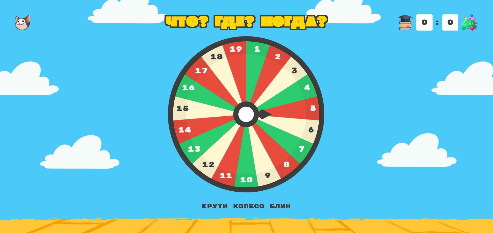

## Запустить

Создать .env файл

```
SECRET_KEY=your_secret_key
DEBUG=True
```

Далее запустить

```
git clone https://github.com/anastasiablokhina/Wheel_Game.git .
python -m venv venv
venv/Scripts/activate
pip install -r requirements.txt
python manage.py migrate
cd frontend
npm i
npm run build
cd ..
python manage.py runserver
```

Вопросы создаются в админке http://127.0.0.1:8000/admin. Чтобы их добавить нужен суперпользователь

```
python manage.py createsuperuser
```

Когда вопросы созданы, можно приступать к игре
<br><br/>
